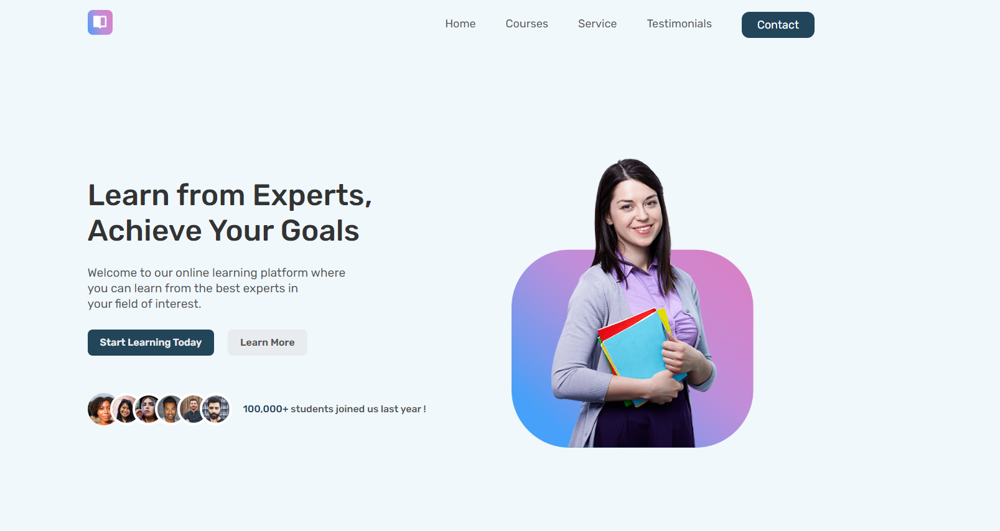

<h1 align="center"> RESPONSIVE landing page design | HTML CSS & JavaScript
   </h1>

Programa exclusivo e gratuito, promovido pela Rocketseat para ensino de tecnologias WEB.  
<a href="https://www.youtube.com/watch?v=aRsc3x-vtPU">Estude esse projeto em formato de vídeo clicando aqui.</a>

  <a href="#-tecnologias">Tecnologias</a>&nbsp;&nbsp;&nbsp;|&nbsp;&nbsp;&nbsp;
  <a href="#-projeto">Projeto</a>&nbsp;&nbsp;&nbsp;|&nbsp;&nbsp;&nbsp;
  <a href="#-layout">Layout</a>&nbsp;&nbsp;&nbsp;|&nbsp;&nbsp;&nbsp;
  <a href="#memo-licença">Licença</a>

  

 

  

## 🚀 Tecnologias

Esse projeto foi desenvolvido com as seguintes tecnologias:

- HTML e CSS
- JavaScript
- Gsap
- Git e Github

## 💻 Projeto

Landing page responsive

- [Assistir aulas](https://www.youtube.com/watch?v=aRsc3x-vtPU)

## :memo: Licença

Esse projeto está sob a licença MIT.

---

Tutorial reproduzido [Pedro Germano](https://www.linkedin.com/in/pedrogermano232/)  
Creditos: [Annicode](https://www.youtube.com/watch?v=aRsc3x-vtPU)
